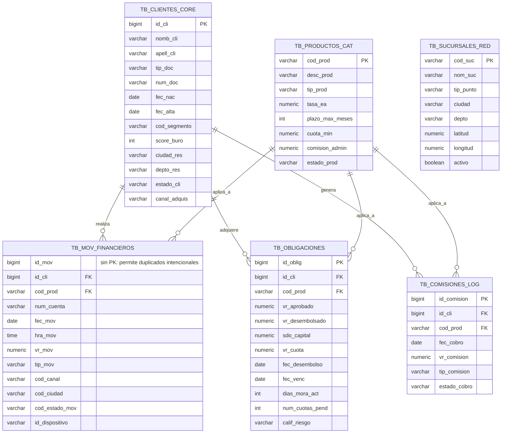

# Diagrama Entidad-Relación — Fuente FinBank (sistema transaccional legado)

Este diagrama representa el esquema **origen** (RDS PostgreSQL), tal como se
definió en `data-generation/schema.sql`. Es el punto de partida que la capa
Bronze del pipeline ingiere sin transformaciones.

> Nota: `TB_SUCURSALES_RED` no tiene una FK directa en el esquema origen (no
> existe columna que vincule sucursal con cliente/movimiento en las tablas
> fuente definidas por el enunciado). La relación con `dim_canal` /
> `dim_geografia` se construye en la capa Gold a partir de `cod_ciudad` como
> atributo descriptivo, no como llave.
